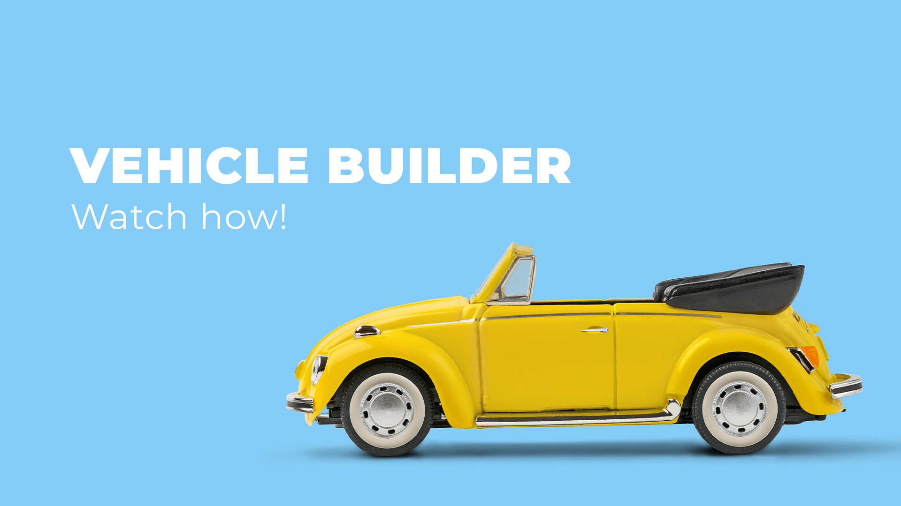

# Vehicle Builder from the CLI


## Table of Contents
- [Description](#description)
- [Installation](#installation)
- [Usage](#usage)
- [License](#license)
- [Contributing](#contributing)
- [Tests](#tests)
- [Questions](#questions)

## Description
Build and drive a car, from the terminal. Build a car from scratch through a command line interface application, then drive it off to the sunset. Simply open the terminal, start the application, and let us help you build and drive the car of your dreams.

## Installation
To install the necessary dependencies, run the following command:

```
npm install
```

## Usage
To begin the application, please run this command in the command line interface:

```
npm start
```

Follow the prompts to create or select a vehicle, and through until you can drive and operate the vehicle of your choice. You will also be able to select 'Print Details' to see what actions you have taken.

### Demo Video
[](https://drive.google.com/file/d/1_9zT3OpjmrCfQxsHsm1x_3QI4pHRYDnf/view?usp=sharing)

This demo shows the program's features, including creating the vehicle and operating, as well as exiting the application. 


## License
This project is licensed under the [MIT](https://opensource.org/licenses/MIT) license.

## Contributing
If you'd like to contribute to this project, please fork the repository and submit a pull request. For any major changes, please open an issue first to discuss what you'd like to change.

## Tests
To run tests, use the following command:

```
npm test
```

## Questions
If you have any questions about the project, feel free to contact me:

- GitHub: [JakeStair](https://github.com/JakeStair)
- Email: jacob.watson00@yahoo.com
